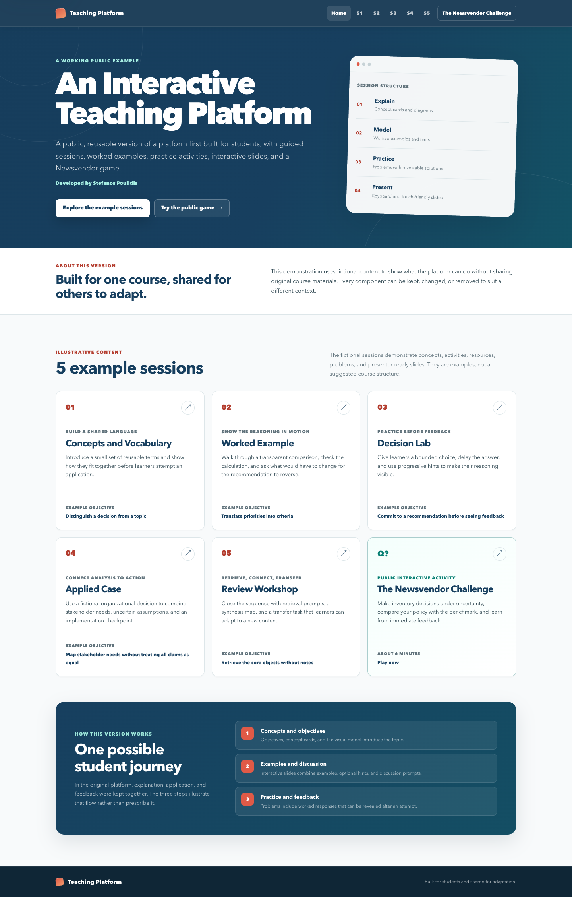

# Interactive Teaching Platform

A reusable, zero-build version of a platform developed for guided teaching materials, interactive slides, worked examples, practice activities, and a public Newsvendor game. It runs as plain HTML, CSS, and JavaScript, so it can be adapted without a framework, database, or build pipeline.

[Open the live demo](https://stefanospoulidis.github.io/course-tutorial-platform/) · [Create your own repository from this template](https://github.com/StefanosPoulidis/course-tutorial-platform/generate) · [See how to adapt it](docs/GETTING_STARTED.md)



The repository ships with five newly written synthetic sessions. They demonstrate the platform structure without reproducing any private course pack, assessment, recording, or worked solution from the teaching environment that inspired the platform.

This public edition preserves the dashboard, session flow, presenter experience, and Newsvendor game developed through live teaching use. The original INSEAD tutorial materials have been deliberately excluded and replaced with institution-neutral examples designed for open adaptation.

It is offered as one practical example, not as a prescription for course design. Every component can be kept, changed, or removed depending on the course, instructor, and students.

> [!IMPORTANT]
> A public static site is fully public. Every file committed here, deployed through GitHub Pages, or downloaded by a browser must be treated as openly accessible. Do not add restricted teaching materials, student information, answer keys, recordings, passwords, or private institutional assets. Link restricted resources to an authenticated LMS or another server-side access-controlled service instead.

## Start your own platform

1. Select [**Use this template**](https://github.com/StefanosPoulidis/course-tutorial-platform/generate) to create a new repository in your own account or organization. This gives your course an independent repository without carrying over this project's Git history.
2. Clone your new repository and run `npm run serve`.
3. Replace the identity and colors in `js/site-config.js`.
4. Replace the fictional sessions in `js/content.js`, one session at a time.
5. Run `npm run check`, complete the release checklist, and enable GitHub Pages when the site is ready.

The [Getting started guide](docs/GETTING_STARTED.md) explains the setup and file structure. The optional [notes on the sample sessions](docs/TEACHING_DESIGN_GUIDE.md) describe how this particular demonstration uses the available features.

## What is included

- A responsive course dashboard and five synthetic sample sessions
- Concept cards, diagrams, practice problems, revealable answers, readings, and presenter mode
- KaTeX-powered mathematical notation with the library bundled locally
- A complete public Newsvendor Challenge with eight decisions and immediate feedback
- Centralized site branding in `js/site-config.js`
- Centralized teaching content in `js/content.js`
- Automated checks for content shape and accidental private-material leakage
- Documentation for adapting, deploying, and maintaining the platform

No account system, database, analytics, or student-data collection is included.

## Try it locally

No installation or build is required.

```bash
git clone https://github.com/StefanosPoulidis/course-tutorial-platform.git
cd course-tutorial-platform
npm run serve
```

`npm run serve` uses Python's standard HTTP server. If you do not use npm, run `python3 -m http.server 8000` directly. Open `http://localhost:8000` in a browser. A local HTTP server is recommended because browser security rules can make some behavior inconsistent when HTML files are opened directly from disk.

To run the repository checks, install a current Node.js release and run:

```bash
npm run check
```

This integrated command checks the public-content boundary, validates the configuration and five-session data model, and tests the Newsvendor calculations. Run `npm test` when you want the game tests alone.

## Explore the demo in ten minutes

The synthetic sequence doubles as a tour of the platform's features.

| Stop | What to inspect | What the sample demonstrates |
| --- | --- | --- |
| Dashboard | Study path and session cards | A visible sequence of learner-facing materials |
| Session 1 | Concept cards, diagram, and first problem | Shared vocabulary followed by a small application |
| Session 2 | Calculation and sensitivity check | Visible reasoning and its dependence on assumptions |
| Session 3 | Progressive presenter hints | An initial attempt followed by optional support |
| Session 4 | Fictional organizational case | Analysis connected to stakeholders and implementation |
| Session 5 | Retrieval and transfer prompts | Reconstruction and application in a new context |
| Newsvendor Challenge | Eight linked decisions and benchmark feedback | Controlled comparison with immediate feedback |

Open each session's interactive slides to see the available layouts and hints. They are public learner-facing scaffolds, not hidden instructor notes. The optional [notes on the sample sessions](docs/TEACHING_DESIGN_GUIDE.md) explain the choices made in this demo, which are examples rather than a prescribed teaching method.

## Adapt it for a course

Most adaptations require only two files:

1. Edit `js/site-config.js` to set the course title, instructor, institution, colors, footer, and game visibility.
2. Replace the synthetic `SESSIONS` entries in `js/content.js` with material you wrote or have permission to publish.

The five-session demo is a starting point, not a fixed course structure. You can rename, reorder, add, or remove sessions. You can also use the same shell for methods training, executive education, professional workshops, laboratory preparation, or any course that benefits from a guided sequence of concepts, activities, and worked feedback.

For detailed instructions, see:

- [Getting started](docs/GETTING_STARTED.md)
- [Site configuration](docs/ADAPTING_THE_PLATFORM.md#1-set-the-course-identity)
- [Content model](docs/CONTENT_MODEL.md)
- [Newsvendor game](docs/NEWSVENDOR_GAME.md)
- [Privacy and access](docs/PRIVACY_AND_ACCESS.md)
- [Deployment](docs/DEPLOYMENT.md)
- [Release checklist](docs/RELEASE_CHECKLIST.md)

## Repository map

```text
.
├── index.html                  Course dashboard
├── session.html                Session view
├── present.html                Full-screen teaching view
├── newsvendor-game.html        Public Newsvendor Challenge
├── js/
│   ├── site-config.js          Identity, theme, and feature settings
│   ├── content.js              Five synthetic sessions and your replacements
│   ├── app.js                  Dashboard and session rendering
│   ├── presenter.js            Presenter-mode behavior
│   └── game.js                 Newsvendor simulation
├── css/                        Site, presenter, and game styling
├── vendor/katex/               Vendored math-rendering dependency
├── scripts/                    Validation and public-boundary checks
├── docs/                       Adaptation and deployment guides
└── PUBLIC_CONTENT_MANIFEST.json Public-release policy used by validation
```

## Keeping restricted resources restricted

This repository intentionally has no password gate. A password prompt implemented only in browser JavaScript does not protect files on a static host. If students should authenticate before opening a deck, recording, case, dataset, or solution:

1. store that resource in your institution's authenticated LMS or another server-side protected system;
2. add only the authenticated HTTPS link to the relevant session;
3. confirm that a signed-out browser cannot retrieve the resource; and
4. keep the file itself out of this repository and its Git history.

See [Privacy and access](docs/PRIVACY_AND_ACCESS.md) for the threat model and safe publishing patterns.

## Design choices in this version

- **Content is data.** Instructors can change course material without rewriting page templates.
- **Public means public.** The repository never presents client-side hiding as access control.
- **Low operational burden.** A static host is enough, and no package installation is required for normal use.
- **Portable by default.** Relative paths allow deployment at a project subpath, including GitHub Pages.
- **Accessible interaction.** Controls should remain keyboard operable, labeled, and readable at common screen sizes.
- **Safe examples.** Included sessions are synthetic and should be replaced only with content that is cleared for publication.

## Credits

The platform architecture and Newsvendor Challenge were designed and developed by **Stefanos Poulidis**.

The private tutorial practice that motivated this public infrastructure benefited from exercises developed and refined over many years by Jiatao Ding, Bengisu, Clara Carrera, and many other outstanding INSEAD PhD colleagues. Their original materials are **not included in this repository and are not licensed by this repository**. The demo sessions here are newly written synthetic examples.

See [Acknowledgments](ACKNOWLEDGMENTS.md) for the complete attribution statement.

## Licensing

- Source code is available under the [MIT License](LICENSE).
- Original synthetic demo educational content and documentation are available under [Creative Commons Attribution 4.0 International](LICENSES/CC-BY-4.0.txt).
- KaTeX remains under its own MIT license. See [Third-party notices](THIRD_PARTY_NOTICES.md).
- Names, logos, trademarks, private course materials, and third-party teaching materials are not relicensed.

The precise file and content boundaries are explained in [Licensing](LICENSING.md).

## Contributing

Adaptations, accessibility improvements, fixes, and broadly useful teaching features are welcome. Read [Contributing](CONTRIBUTING.md), follow the [Code of Conduct](CODE_OF_CONDUCT.md), and keep every contribution inside the public-content boundary.

If you discover an exposed private resource, credential, or student record, do not open a public issue. Follow [Security](SECURITY.md) instead.
